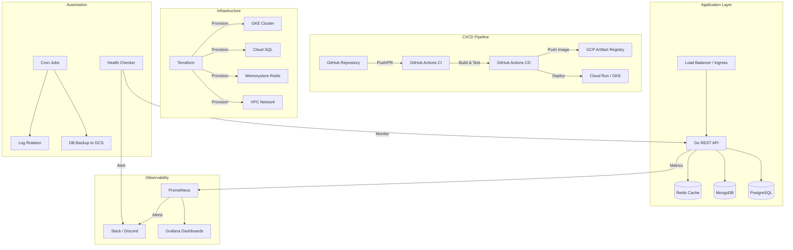

# 🚀 DevOps / SRE Portfolio — Hamfa

Production-grade DevOps portfolio demonstrating infrastructure automation, CI/CD pipelines, container orchestration, and observability.

## 🏗️ Architecture Overview



## 📂 Project Structure

| Directory                                  | Description                    | Technologies                         |
| ------------------------------------------ | ------------------------------ | ------------------------------------ |
| [`app/`](app/)                             | Golang REST API (Task Manager) | Go, Gin, pgx, mongo-driver, go-redis |
| [`.github/workflows/`](.github/workflows/) | CI/CD Pipelines                | GitHub Actions, Docker, GCP          |
| [`k8s/`](k8s/)                             | Kubernetes & Helm Chart        | K8s, Helm, HPA, Ingress              |
| [`automation/`](automation/)               | Automation Scripts             | Bash, Go, Terraform                  |
| [`monitoring/`](monitoring/)               | Observability Stack            | Prometheus, Grafana                  |
| [`docs/`](docs/)                           | Architecture & Processes       | Markdown                             |

## ⚡ Quick Start

```bash
# 1. Clone the repository
git clone https://github.com/hamfa/devops-portfolio.git
cd devops-portfolio

# 2. Start the application stack
cd app && docker compose up -d

# 3. Test the API
curl http://localhost:8080/health

# 4. Start monitoring stack
cd ../monitoring && docker compose up -d
# Grafana: http://localhost:3000 (admin/admin)
# Prometheus: http://localhost:9090
```

## 🎯 Skills Matrix

| Skill                   | Demonstrated By                                                |
| ----------------------- | -------------------------------------------------------------- |
| **Git**                 | Repository structure, branching, CI/CD triggers                |
| **Linux/Unix**          | Bash scripts, cron, logrotate, shell automation                |
| **GCP**                 | Cloud Run, GKE, Cloud SQL, Memorystore, GCS, Artifact Registry |
| **CI/CD**               | GitHub Actions (lint → test → build → deploy)                  |
| **System Architecture** | Microservice design, high availability, auto-scaling           |
| **Automation**          | Backup scheduler, health monitor, log rotator                  |
| **Docker**              | Multi-stage builds, docker-compose, health checks              |
| **Kubernetes**          | Deployments, Services, Ingress, HPA, ConfigMaps                |
| **Helm**                | Custom chart, values templating, multi-env support             |
| **Redis**               | Cache-aside pattern, TTL management                            |
| **PostgreSQL**          | Schema design, indexes, migrations, backups                    |
| **MongoDB**             | Activity logging, document queries                             |
| **Golang**              | REST API, concurrent health checker, structured logging        |

## 📁 Detailed Components

### 🔹 Application (Go REST API)

- **Framework**: Gin with middleware stack (logging, recovery)
- **Database**: PostgreSQL (primary) + MongoDB (activity logs) + Redis (cache)
- **Pattern**: Cache-aside with TTL, graceful shutdown, health checks
- **Docker**: Multi-stage build, non-root user, <30MB image

### 🔹 CI/CD Pipeline

- **CI**: `go vet` → `golangci-lint` → `go test -race` → Docker build → Helm lint
- **CD**: Build → Push to Artifact Registry → Deploy to Cloud Run
- **Auth**: Workload Identity Federation (keyless)

### 🔹 Kubernetes

- **Raw manifests**: Namespace, Deployment, Service, Ingress, HPA, ConfigMap, Secret
- **Helm Chart**: Parameterized templates, multi-environment values
- **Auto-scaling**: CPU/memory metrics with stabilization windows

### 🔹 Automation

- **Backup Scheduler**: pg_dump → gzip → GCS upload → Slack alerts
- **Health Checker**: Go CLI with goroutines for concurrent monitoring
- **Log Rotator**: Size-based rotation with compression and retention
- **Infra Provisioner**: Terraform for GKE, Cloud SQL, VPC, GCS

### 🔹 Monitoring

- **Prometheus**: Scrape configs, alert rules (app, infra, database)
- **Grafana**: Dashboard with request rate, latency p50/p90/p99, resource usage
- **Alerting**: Error rate, latency, CPU, memory, disk, DB connections

## 📄 Documentation

- [Architecture Design](docs/architecture.md) — System design with diagrams
- [Post-Incident Template](docs/post-incident-template.md) — Incident response process
- [Capacity Planning](docs/capacity-planning.md) — Capacity analysis methodology

## 📜 License

MIT License
