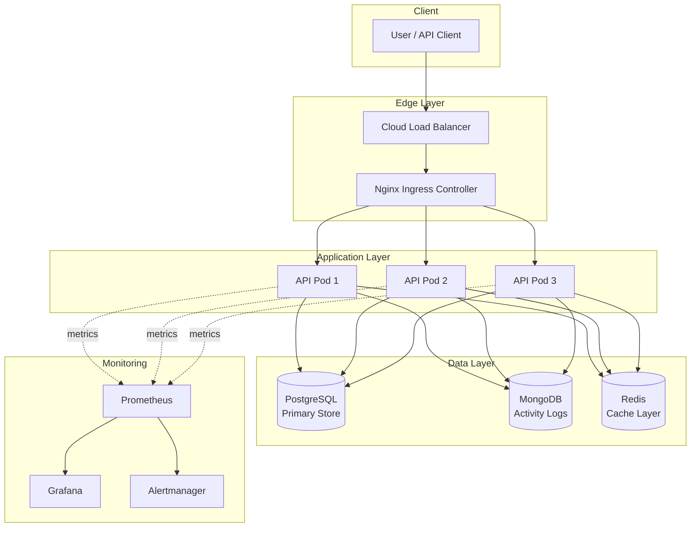
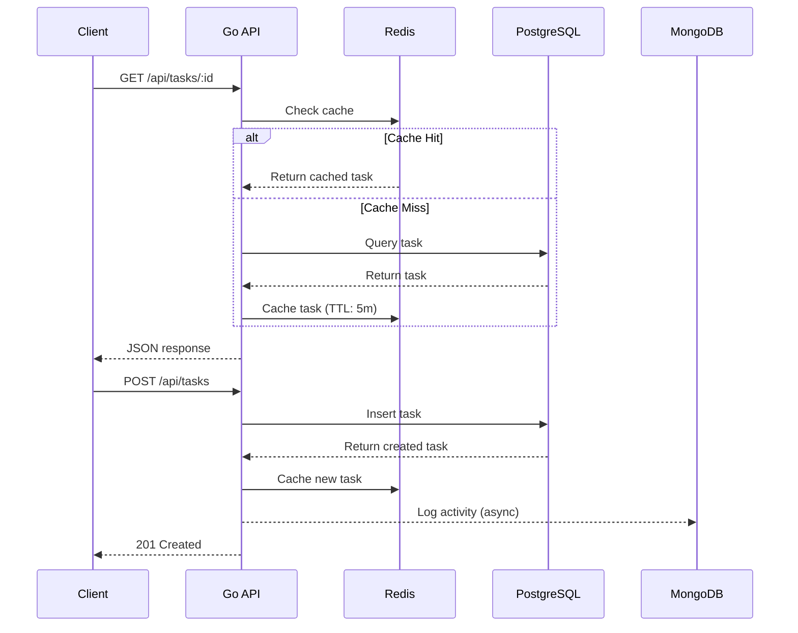
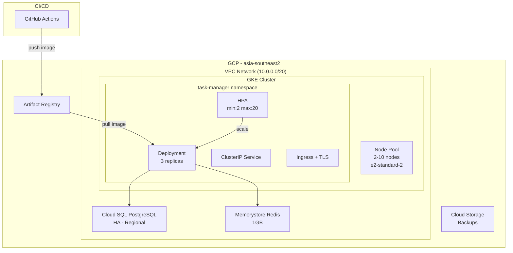

# System Architecture

## High-Level Architecture

## Request Flow

## Deployment Architecture

## Design Decisions

### Why Golang?

- Compiled binary → minimal Docker image (<30MB)
- Built-in concurrency with goroutines
- Ecosystem: Docker, Kubernetes, Terraform all written in Go
- Strong typing reduces production bugs

### Why Multi-Database?

- **PostgreSQL**: ACID for critical task data, strong query capabilities
- **MongoDB**: Flexible schema for audit/activity logs, easy aggregation
- **Redis**: Sub-millisecond caching, reduces DB load by ~70%

### Why Cache-Aside Pattern?

- Application controls cache lifecycle
- Database remains source of truth
- Graceful degradation if Redis is down (fallback to DB)

### High Availability Strategies

1. **HPA**: Auto-scale pods based on CPU/memory metrics
2. **Topology Spread**: Distribute pods across nodes
3. **Rolling Updates**: Zero-downtime deployments
4. **Health Probes**: Startup, liveness, readiness checks
5. **Cloud SQL HA**: Regional instance with automatic failover
